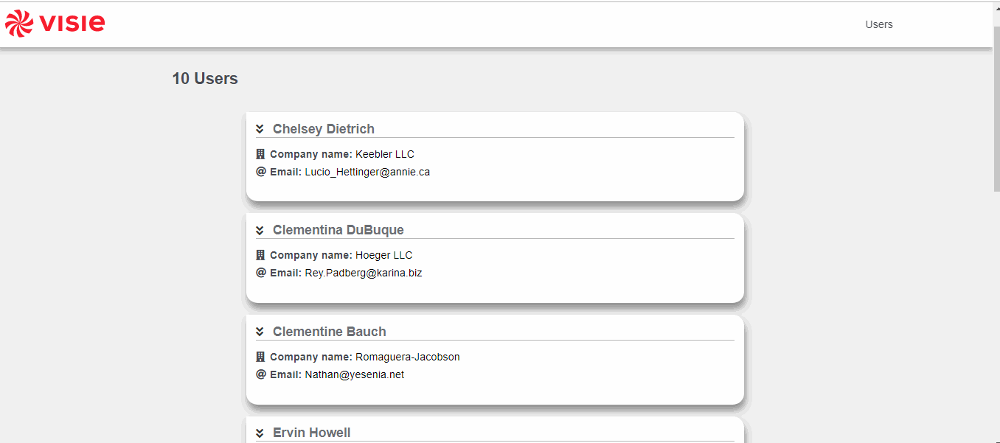

<h1 align="center">Consumes API Users - Vue.js</h1>

### :mag: Sobre o projeto

É uma aplicação web que consome uma API de testes disponível em (https://jsonplaceholder.typicode.com/users) e exibe como uma listagem os usuários recuperados utilizando componentes personalizados, tendo opção de exclusão de cada item da lista.

### 🛠️ Tecnologias

- HTML
- CSS
- JavaScript
- Vue
- Vue-toast-notification

### :key: Executar a aplicação

Abrindo a pasta do projeto, executar os comandos:  
$ npm install  
$ npm run  

ou teste no link abaixo.  
https://codesandbox.io/s/github/raissaboeng/consumes-api-users-vue

### :bulb: Melhorias
[ ] Adicionar usuários;  
[ ] Edição de usuários;  

Com 💜 por Raissa Boeng

